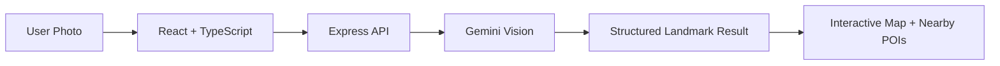

# CityLens

[](https://github.com/AloneRider-pixel/Citylens/actions/workflows/ci.yml)

**AI-powered city and landmark exploration web application.**

CityLens accepts a city/landmark photo, sends it through a server-side Gemini vision integration, normalizes the result into structured data, and presents the recognition result together with nearby points of interest on an interactive map.

> **Portfolio focus:** React + TypeScript + Node.js + Gemini vision + geospatial UI + PWA engineering.

## Architecture



## Engineering highlights

- Gemini credentials stay on the server rather than in the browser bundle.
- API responses are normalized before reaching the UI.
- Image request bodies are bounded to avoid unbounded payload growth.
- Security headers are applied at the server boundary.
- Recognition and map functionality are separated so the geospatial experience is not coupled to model execution.
- CI performs dependency installation, type/lint validation, and a production build.
- Dependabot and CodeQL provide dependency and static-analysis automation.
- PWA service-worker support enables an installable web experience.

## Technology stack

| Layer | Technology |
|---|---|
| Frontend | React 19, TypeScript, Vite |
| Backend | Node.js, Express |
| AI | Google Gemini SDK |
| Maps | Leaflet |
| Styling | Tailwind CSS |
| UX | Motion, Lucide React |
| Platform | PWA service worker |
| Quality | GitHub Actions, TypeScript checks |

## Repository structure

```text
Citylens/
├── src/
│   ├── components/             # UI components
│   ├── context/                # Application state
│   ├── data/                   # Local application data
│   ├── services/               # External/API services
│   ├── App.tsx
│   ├── main.tsx
│   ├── types.ts
│   └── serviceWorkerRegistration.ts
├── server.ts                   # Express + Gemini API boundary
├── vite.config.ts
├── package.json
└── .github/workflows/ci.yml
```

## Local development

### Setup

```bash
git clone https://github.com/AloneRider-pixel/Citylens.git
cd Citylens
cp .env.example .env
pnpm install
```

Set the server-side API key in `.env`:

```text
GEMINI_API_KEY=your_key_here
```

Never commit a real API credential.

### Run

```bash
pnpm dev
```

### Quality checks

```bash
pnpm lint
pnpm build
```

## Security considerations

- Keep `GEMINI_API_KEY` server-side.
- Validate uploaded image MIME types and payload size before public deployment.
- Add authentication and rate limiting before exposing the recognition endpoint at scale.
- Treat model-generated coordinates and nearby-POI information as unverified unless independently validated.

## Roadmap

- Unit/integration tests for the recognition API boundary.
- Runtime schema validation for model/API responses.
- API rate limiting and structured request logging.
- Versioned evaluation set for landmark-recognition quality.
- Provider abstraction for additional vision models.
- Geospatial result verification and caching.

## License

MIT
