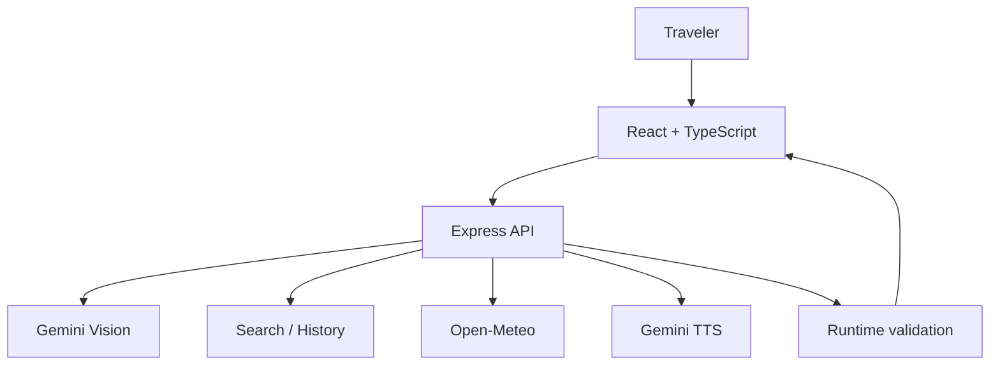

# CityLens — AI City & Landmark Explorer

[](https://github.com/AloneRider-pixel/Citylens/actions/workflows/ci.yml)
[](https://github.com/AloneRider-pixel/Citylens/actions/workflows/codeql.yml)
[](LICENSE)

AI-powered city and landmark exploration web app built around server-side vision inference, validated responses, maps, and a progressive web app experience.

## What it does

CityLens turns a city photograph into a structured exploration experience:

```text
Photo
  ↓
React + TypeScript
  ↓
Express API
  ↓
Gemini vision / search / TTS
  ↓
Validated landmark result
  ↓
History · map · weather · quiz · narration
```

The browser is the presentation layer. Provider credentials and expensive AI calls stay behind the server boundary.

## Engineering highlights

- Server-side Gemini integration with explicit input validation.
- Route-specific payload limits for image-heavy requests and smaller global API payloads.
- Early IP-based rate limiting and periodic cleanup to reduce abuse and memory growth.
- Security headers and reduced framework fingerprinting.
- Runtime validation for landmark-recognition responses before they reach the UI.
- PWA support for an installable web experience.
- CI covering lint, type checks, tests, builds, CodeQL, dependency review, Scorecard, and synthetic validation.

## Architecture


```mermaid
graph TB
    USER[Traveler] --> UI[React + TypeScript]
    UI --> API[Express API]
    API --> VISION[Gemini Vision]
    API --> SEARCH[Search / History]
    API --> WEATHER[Open-Meteo]
    API --> TTS[Gemini TTS]
    API --> VALID[Runtime validation]
    VALID --> UI
```

## Stack

| Layer | Technology |
|---|---|
| Frontend | React 19, TypeScript, Vite |
| Backend | Node.js, Express |
| AI | Google Gemini SDK |
| Maps | Leaflet |
| Styling | Tailwind CSS |
| Platform | PWA |
| Security / CI | GitHub Actions, CodeQL, Dependabot, Scorecard |

## Repository map

```text
src/components/          # UI components
src/services/            # API / client services
server.ts                # Express entrypoint and API routes
image-validation.ts      # image/content validation
server-validation.ts     # model response validation
public/                  # static/PWA assets
package.json             # scripts and dependencies
pnpm-lock.yaml           # reproducible dependency graph
.github/workflows/       # CI and security verification
```

## Quick start

Prerequisites: Node.js compatible with the repository toolchain and pnpm.

```bash
git clone https://github.com/AloneRider-pixel/Citylens.git
cd Citylens
cp .env.example .env
pnpm install --frozen-lockfile
pnpm dev
```

Set the server-side provider credential:

```text
GEMINI_API_KEY=...
```

Never commit a real credential or expose server-only secrets through browser configuration.

## Verification

```bash
pnpm install --frozen-lockfile
pnpm lint
pnpm test
pnpm build
```

CI also runs security and synthetic validation. Review API validation and the provider integration together when changing request/response contracts.

## Security model

User uploads, prompts, model output, and external geospatial/weather data are untrusted. Bound inputs before expensive processing, validate model responses before serialization, keep provider credentials server-side, and preserve rate limiting and error isolation.

The in-memory rate limiter is an application-level control, not a substitute for a distributed production gateway/WAF when the service is horizontally scaled.

## Evidence policy

Deterministic tests establish software behavior, not real-world landmark-recognition accuracy. Public claims about recognition quality, reliability, latency, or coverage should identify the provider/model, dataset, sample count, methodology, environment, and producing commit.

## Documentation

- [Security](SECURITY.md)
- [Verification](docs/verification.md)
- [Evidence policy](docs/evidence-policy.md)

## Contribution standard

Keep provider calls bounded, maintain explicit validation at API boundaries, add regression coverage for security fixes, and document any change to trust boundaries or external API dependencies.

## Roadmap

Versioned landmark evaluation datasets, broader provider/geospatial verification, distributed rate limiting, and expanded runtime schema validation.

## License

MIT
